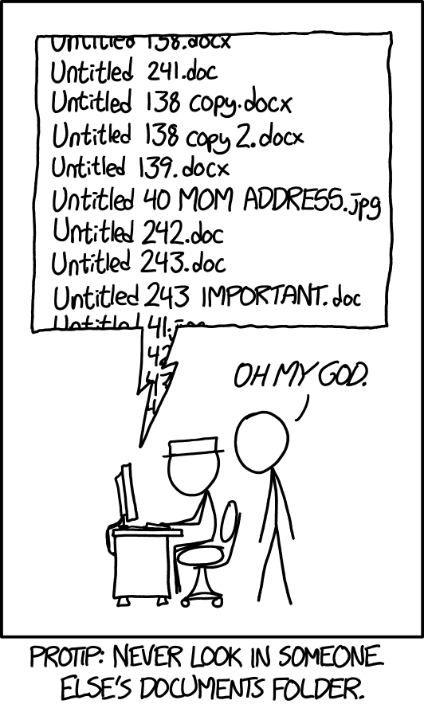

# Open Science for collaboration {#collaborate}

```{r, echo = F, warning = F, message = F}
knitr::opts_chunk$set(echo = F, fig.align = 'center', out.width = '100%')

library(fontawesome)
```

## Lesson Outline

* [Goals and motivation]
* [Essential elements of collaboration]
* [Tools for collaboration]
* [Balancing and managing expectations]

## Goals and motivation

This is the second module in our four hour workshop on open science.  This module will explore some open science tools to help you and your team become better collaborators and to better engage your science with external partners.  We'll introduce some essential elements of collaboration and discuss some readily available tools for doing so.  We'll close with a discussion on balancing and managing expectations for collaboration in the rapidly evolving online arena.

* __Goal__: understand modalities of collaboration and the pros/cons of various tools
* __Motivation__: start building the tools for your open science toolbox

## Essential elements of collaboration

We start our deep dive into open science by focusing on collaboration as the single most important activity that can be enhanced through transparent, efficient, and reproducible tools.  Having effective tools to work together is a critical theme of many open science practices.  There are many tools in the toolbox and we need to introduce some core concepts before we show by doing.  

### Workflow management

How do you organize your work each day?  How do you make sure pressing deadlines are met on schedule? How do you plan for short-term and long-term goals?  Do you have a five-year, ten-year, or longer career plan? 

Work to achieve goals cannot be accomplished without a systematic approach to organizing tasks.  Chances are, we each have our own system that works for us based on our obligations as career scientists.  Most people have what works for them and this can come in conflict when we try to mesh internal workflows with those of others.  

Does this look familiar?  

```{r, out.width = '50%'}

```

Although the above comic from [xkcd](https://xkcd.com/) speaks directly to file structures, it hints at a broader problem of personal information management that can seriously complicate working with others. I'm sure we've all been in the scenario of endless email attachments with changing names.  

More generally, collaborative work can be facilitated through workflow management.  We'll discuss some specific software tools for strict version control, but we can talk broadly about internet-based tools to facilitate workflows either for yourself or, better yet, working with others. These can help propel you towards open science.

Here, we introduce the Kanban approach to workflow management. The idea is simple.  Create a task-oriented workflow of card management organized by progress. It looks something like this: 

```{r, out.width = '60%'}
knitr::include_graphics('img/kanban.jpg')
```

As shown, this approach can work as a literal, physical board or as one used digitally through a web browser or other software.  Every Kanban board has the following elements that allow you to work in a more informed manner:

* Provides a "big picture" of progress
* Organizes progress by discrete steps
* Establishes cards as specific tasks

Many of the open science tools we describe below use this system. It is a generalizable format that works in different settings, whether it be general project management or something more formal like software development. 

### Version control 

Our file naming example above represents a specific problem stemming from insufficient rules to organize information.  Workflows can greatly be enhanced by tools that use strict guidelines for tracking changes and allowing a complete view of the evolution of a project.  This is where version control comes in. 

Version control is a way to track the development history of a project. It serves the joint purposes of: 

1. Formally documenting the changes that have been made to code or software
1. making sure that the development history is permanent. 

It's more than saving files. Documenting changes provides a transparent record for yourself and others, and establishing permanency ensures that any of the changes that are made can be vetted and accessed as needed. Think of it as an insurance plan for your project.

By far, the most widely use software for version control is Git.  Although we do not cover the specifics of this software, it's useful to understand it's purpose and what it can do in making your work more open and impactful. Git is integrated with many popular open source development platforms, such as RStudio. 

```{r, out.width = '60%'}
knitr::include_graphics('img/gitxkcd.png')
```

Many people often confuse Git with GitHub. GitHub is an online platform for working collaboratively through Git. We'll provide some examples below of how this can be done.  Importantly, you do not need to be an expert in Git to be able to use GitHub.  This speaks volumes for how team efficiency can be improved through better collaboration. 

### Data repositories

How data are treated as living, dynamic pieces of information is critical to the whole ethos of open science. This is especially true when the [FAIR](#fair) principles are invoked.  Data should not live on your hardrive as something only known to yourself. 

Although we will not cover data repositories in depth, it's important to recognize the critical role that data archiving and metadata have in open science.  How many times have you thought "wow, it would be great if I could have the data from this paper!" Making data open is a great way to propel science through better and kinder collaboration.  

In most cases, getting a dataset online is straightforward but the ease of doing so depends on where you want to put the data. In all cases, your dataset should be tidy and accompanied by metadata.  For simple solutions, such as FTP hosting or putting a dataset on Google Drive, all you need to do is upload the data by hand. This doesn't necessarily make it findable.  

The absolute best standard for hosting data online is through a __Federated Data Repository__:

> An online network of connected repositories that use similar standards to collectively store data for discovery and access. Uploading a dataset to one node of a repository will make it available through all other nodes.

Such repositories follow strict, but necessary guidelines, to ensure your data live forever, so long as the internet exists. The data are definitely findable (e.g., through a web search), accessible (free to download), and interoperable (accepted standards are ensured).  The "reproducible" aspect can be debatable, but that can be solved through other means (e.g., code sharing).

### Code of Conduct

Every great collaborative team does not begin work before a Code of Conduct is created.  This documents a set of community standards within which the work can be completed.  It ensures all viewpoints are heard and respected and establishes a means by which conflicts can be resolved.  

Here's a great example from our friends at [openscapes](https://www.openscapes.org/code-of-conduct/).

The goal of every code of conduct is to ensure an agreed upon set of standards are used by all team members to help create a safe and positive experience. 

### `r fa('hat-wizard')` Exercise

Develop a code of conduct for your group in a shared workspace.  Items to consider:

1. How is inclusion defined and encouraged? 
1. How are similarities and differences recognized?
1. How will conflicts be managed?

## Tools for collaboration

Slack, Trello, Google Docs, Microsoft 360, GitHub, etc.

### `r fa('chalkboard-teacher')` Watch and learn

### `r fa('hat-wizard')` Exercise

In small groups, setup a shared workspace using one of the collaborative platforms 

## Balancing and managing expectations


