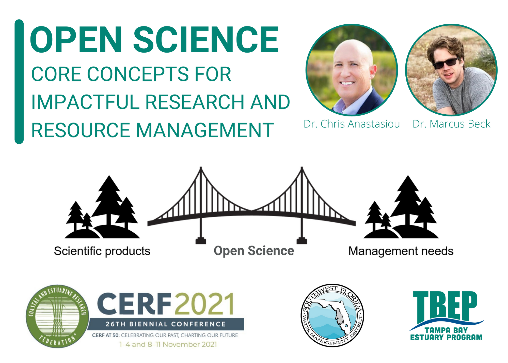

--- 
site: bookdown::bookdown_site
documentclass: book
bibliography: [book.bib]
biblio-style: apalike
link-citations: yes
github-repo: tbep-tech/cerf-os-workshop
description: "This is a web page for the CERF 2021 Open Science Workshop"
---

```{r setup}
knitr::opts_chunk$set(echo = F, fig.align = 'center', out.width = '100%')
```

# Course synopsis {-}

```{r}

```
 
Welcome to the CERF 2021 open science workshop: core concepts for impactful research and resource management. Open science (OS) has been advocated as an effective approach to create reproducible, transparent, and actionable research products. However, widespread adoption among the coastal and estuarine research community has not occurred despite its perceived benefits. In the face of major challenges like global warming and sea level rise, the collaborative framework provided by OS is needed now more than ever. This workshop will cover a half-day of material introducing participants to core concepts of OS. The target audience includes anyone interested in applying OS in their own workflows as part of a larger research and resource management team.

For virtual participants, this workshop would require participants to have access to the internet and specific open science tools like R and GitHub. Ideally, this would be an in person workshop though virtual participation would be possible. For this workshop to be impactful, participants will be encouraged to engage in open discussion and exchange of ideas related to open science. This is accomplished best in person, though via a virtual platform like zoom working groups can be identified and used to help facilitate the exchange of open science ideas across various disciplines and professional sectors.

## Agenda {-}

* \@ref(community): An open science community of practice (__30 min__)
* \@ref(collaborate): Open Science for collaboration (__90 min__)
* \@ref(impact): Open science for impactful products (__90 min__)
* \@ref(implement): Lowering barriers to inclusion and addressing key critiques (__30 min__)
